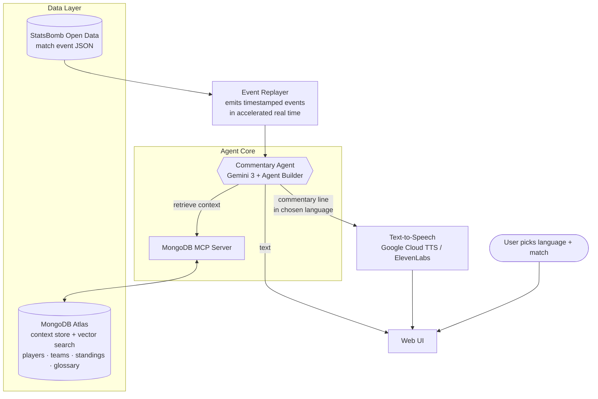

# 🎙️ MlangCast — Multilingual AI Football Commentary


-00ED64)


**Live(-ish) play-by-play football commentary, generated by an AI agent, in the language of your choice — built for the matches and markets that currently have no commentator at all.**

Built for the [Google Cloud Rapid Agent Hackathon](https://rapid-agent.devpost.com/) using **Gemini 3**, **Google Cloud Agent Builder**, and a partner **MCP (Model Context Protocol) server**.

| | |
|---|---|
| 🌐 **Live demo** | `<hosted-project-url>` *(TBD)* |
| 🎬 **Demo video** | `<3-min-demo-video-url>` *(TBD)* |
| 🏷️ **Submission track** | MongoDB *(TBD [Partner Integration](#partner-integration-mcp))* |

---

## The Problem

In live football, commentary is **not** translated from a single central source. The host broadcaster produces one video "world feed" — the pictures plus natural stadium sound — and each rights-holding broadcaster adds its **own** commentary, independently, in its own language. Whether a given audience gets commentary at all is a rights-and-economics question, not a guarantee.

The result is large gaps:

- **Whole markets get nothing** — only a clean feed (crowd noise, no words), or a feed in a language the viewer doesn't speak. These might not be ideal for those enjoying commentaries or
those who want to understand things that are happening in the match (e.g. why a player got a 
red card, etc.).
- **Under-covered competitions** — lower leagues, women's football, youth, and amateur matches frequently have **no commentary in any language**. For the same reason as above, some people
might find this aspect annoying.

So the honest comparison for this project is **not** "AI vs. a beloved human commentator." It's **AI vs. silence, or AI vs. a feed you can't understand.** (This is the same rationale IBM used when it deployed AI commentary at Wimbledon specifically for matches that have no human commentary — see [References](#references).)

## What It Does

MlangCast stands for Multiple-language Cast. It turns a structured stream of match events into spoken, context-aware commentary in the user's chosen language:

1. **Ingests** a match as a timestamped event stream (pass, shot, foul, card, goal) from StatsBomb open data.
2. **Replays** that stream in accelerated real time to simulate a live match.
3. An **AI agent** (Gemini 3 on Agent Builder) decides *what's worth saying* (pacing — it doesn't narrate every throw-in), *how excited to be*, and *what context to add* — then generates each line **in the target language**.
4. During quiet stretches, an **analyst voice** fills dead air with faithful color about the player on the ball, using retrieved player context plus live in-match tallies.
5. For two-commentator mode, the system generates a sequential **lead + analyst** script: the lead handles play-by-play and goal calls, then the analyst reacts or adds color.
6. The agent **retrieves context** (player history, team form, standings, terminology) by calling a partner **MCP server** as a tool.
7. **Text-to-speech** voices the commentary so the viewer can listen, not just read.
8. A lightweight **web UI** lets the user pick a language and a match and watch the commentary stream beside a match clock.

Because the commentary is **generated natively in the target language**, the multilingual experience is built in — there's no separate translation step and no speech-recognition errors to inherit.

## How It's Different

| | NBC "AI Al Michaels" (Paris 2024) | IBM watsonx (Wimbledon) | **PolyCast** |
|---|---|---|---|
| **Format** | Post-event daily recaps | Highlight clips | Live-ish, full match |
| **Languages** | English | English | Multilingual from the first whistle |
| **How it knows the play** | Human-clipped highlights | Computer vision on video | Structured event data (no CV) |
| **Primary audience** | A saturated mega-event | Show-court overflow | Matches with **no** coverage |
| **Agentic context layer** | — | — | ✅ (retrieval via MCP) |

The sharpest distinction is the data path: IBM took the hard route — computer vision to reconstruct what happened on court. PolyCast reads the play directly from structured events, which is what makes a small-team build feasible and what frees the agent to focus on language, pacing, and context.

## Tech Stack

| Layer | Technology | Notes |
|---|---|---|
| **Reasoning / generation** | Gemini 3 | Required by the hackathon; also handles all language output |
| **Agent orchestration** | Google Cloud Agent Builder | Plan → call tools → respond loop |
| **Partner "superpower" (MCP)** | MongoDB Atlas (Vector Search) | Context store + semantic retrieval, exposed via MongoDB's MCP server |
| **Match data** | [StatsBomb Open Data](https://github.com/statsbomb/open-data) + [`statsbombpy`](https://github.com/statsbomb/statsbombpy) | Free, no auth; JSON events per match (**attribution required**) |
| **Text-to-speech** | Google Cloud Text-to-Speech *(default)* / ElevenLabs *(expressive option)* | Optional but high-impact for the demo |
| **Backend** | Python | Event replayer + orchestration glue |
| **Frontend** | HTML/JS *(or lightweight React)* | Language + match selection, synced text/audio |
| **Hosting** | Google Cloud Run | Provides the public demo URL |
| **Repo / process** | GitHub + OSI license | License must be detectable in the repo's About section |.

## High-Level Architecture



**Flow in words:** the replayer streams match events in real time → the agent receives each event, decides whether it's noteworthy and how to pitch it, calls the MCP server to pull relevant context from MongoDB, and generates a commentary line in the chosen language → TTS voices it → the UI plays text and audio in sync.

## Project Structure

```text
.
├── README.md
├── LICENSE                      # OSI license (e.g., MIT) — required & must be detectable
├── data/
│   └── loader.py                # pulls a match via statsbombpy / open-data
├── replayer/
│   └── event_replayer.py        # streams events in accelerated real time
├── agent/
│   ├── commentary_agent.py      # Gemini 3 + Agent Builder orchestration
│   ├── prompts/                 # pacing, faithfulness, energy, language prompts
│   └── mcp_client.py            # calls the partner MCP server
├── context/
│   └── seed_context.py          # loads players/teams/standings/glossary into MongoDB
├── tts/
│   └── speak.py                 # text → audio
├── web/                         # minimal UI (language + match selection)
└── requirements.txt
```

## Getting Started

**Prerequisites**
- Python 3.10+
- A Google Cloud project with Gemini 3 + Agent Builder access
- A MongoDB Atlas cluster with Vector Search enabled
- (Optional) An ElevenLabs API key for expressive voices

**Run locally**
```bash
git clone <your-repo-url>
cd <repo>
pip install -r requirements.txt

cp .env.example .env            # add GOOGLE_*, MONGODB_URI, (optional) ELEVENLABS_API_KEY

python data/loader.py --match-id <STATSBOMB_MATCH_ID>   # cache a demo match
python context/seed_context.py                          # populate MongoDB context store
python -m web.app                                       # launch UI at http://localhost:8080
```

**Feature smoke tests**
```bash
python -m agent.commentary_agent --sample --mock --two-speakers
python -m pipeline.commentary_pipeline --sample --mock --two-speakers
python -m context.player_stats --match-ids 3869685
```

## Data & Attribution

Match event data is provided free by **StatsBomb** under their public data user agreement. Per that agreement, any research, analysis, or output derived from the data **must credit StatsBomb as the data source**. This project uses it for non-commercial, hackathon/research purposes.

- Source: https://github.com/statsbomb/open-data

## Demo Scope

The hackathon demo is scoped to the **2022 World Cup final** and the Argentina/France player pool. Player-form context is derived by aggregating cached StatsBomb events across whichever WC 2022 matches are supplied to `context.player_stats`; for the fastest local demo, the final alone works, and for fuller tournament color you can cache and pass all Argentina/France match ids.

The ingestion and document schema are not final-only: they accept any cached match list and emit the same `kind: "player"` context documents for MongoDB retrieval.

## Roadmap

- **Real-time feeds** — replace replayed historical data with a live event provider (Opta / Sportradar).
- **More languages & dialects** — especially underserved ones with no broadcast commentary.
- **Voice & style personalization** — let users choose energetic vs. measured commentary, or distinct voices.
- **Optional translation mode** — translate an existing human feed as an alternative to native generation.
- **Accessibility** — captions and audio-descriptive variants for deaf/hard-of-hearing and blind/low-vision viewers.

## Partner Integration (MCP)

The partner technology is integrated as an **MCP server** that the agent calls as a tool to fetch match context (player profiles, team form, standings, head-to-head, football terminology).

- **MongoDB Atlas** *(default)* — document store + Vector Search; natural home for the context/translation-memory layer.

## References

- Hackathon — Google Cloud Rapid Agent Hackathon: https://rapid-agent.devpost.com/
- StatsBomb Open Data: https://github.com/statsbomb/open-data
- StatsBomb Python client (`statsbombpy`): https://github.com/statsbomb/statsbombpy
- IBM — AI sports commentary (watsonx, Wimbledon/US Open): https://www.ibm.com/think/news/future-tennis-broadcasting-ai-sports-commentary
- IBM x Wimbledon AI commentary (ESPN): https://www.espn.com/tennis/story/_/id/37890817/wimbledon-ibm-team-ai-generated-highlight-commentary
- NBC/Peacock — AI Al Michaels Olympic recaps (press release): https://www.nbcsports.com/pressbox/press-releases/peacock-unveils-personalized-olympic-recaps-featuring-the-voice-of-legendary-sports-announcer-al-michaels-generated-with-a-i

## License

Released under the **MIT License** — see [`LICENSE`](LICENSE). *(Add the actual license file before submitting; the hackathon requires a detectable open-source license at the top of the repo.)*

## Acknowledgments

Google Cloud & Gemini · the partner team MongoDB · **StatsBomb** for free open data · the Rapid Agent Hackathon organizers.
